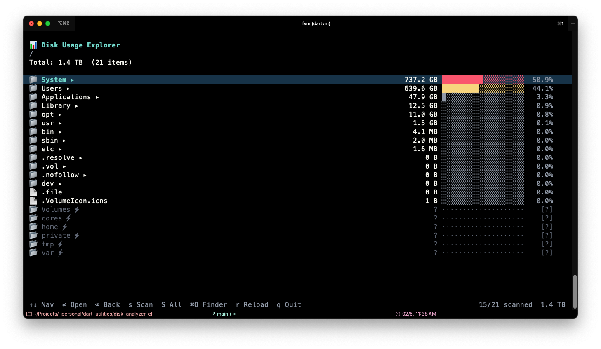

# Disk Analyzer CLI

A Dart CLI tool to analyze disk space usage.

## Features

- **Scan** directories and cache results in SQLite for fast repeated queries
- **Interactive TUI** — navigate your filesystem with a terminal UI, see sizes and percentages at a glance
- **Physical sizes** — uses native `lstat()` via FFI to report actual disk allocation (`st_blocks * 512`), matching `du` and Finder
- **Delete** files/folders with size preview, confirmation, and dry-run mode

## Installation

```bash
dart pub global activate disk_analyzer_cli
```

Or run directly:

```bash
dart run bin/disk_analyzer_cli.dart <command>
```

## Commands

### `scan` — Scan a directory

```bash
# Scan current directory
disk_analyzer_cli scan

# Scan a specific path
disk_analyzer_cli scan /Users/dominik

# Limit scan depth
disk_analyzer_cli scan /Users/dominik --max-depth 4

# Stop after 5 minutes
disk_analyzer_cli scan /Users/dominik --timeout 5m
```

### `show` — Display cached scan data

```bash
# Show top-level usage
disk_analyzer_cli show /Users/dominik

# Show 3 levels deep, top 10 per level
disk_analyzer_cli show /Users/dominik --depth 3 --top 10

# Sort by name, directories only
disk_analyzer_cli show /Users/dominik --sort name --dirs-only

# Filter by minimum size
disk_analyzer_cli show /Users/dominik --min-size 1GB
```

### `tui` — Interactive terminal UI



```bash
# Launch TUI for a scanned path
disk_analyzer_cli tui /Users/dominik
```

**Keyboard shortcuts:**

| Key                 | Action                                |
| ------------------- | ------------------------------------- |
| `↑` `↓`             | Navigate entries                      |
| `Enter`             | Open folder                           |
| `Backspace` / `Esc` | Go back (restores previous selection) |
| `s`                 | Scan selected folder (background)     |
| `S` (Shift+S)       | Scan all unscanned folders            |
| `o`                  | Open in Finder                        |
| `r`                 | Reload current view                   |
| `PgUp` / `PgDn`     | Page navigation                       |
| `Home` / `End`      | Jump to first/last                    |
| `q`                 | Quit                                  |

The TUI automatically discovers folders on disk that aren't in the cache (shown with `📂⚡`), auto-adds new files, and prunes deleted entries when opening a folder.

### `delete` — Delete files or folders

```bash
# Delete with confirmation and size preview
disk_analyzer_cli delete /path/to/large/folder

# Dry run — see what would be deleted
disk_analyzer_cli delete /path/to/folder --dry-run

# Skip confirmation
disk_analyzer_cli delete /path/to/folder --force
```

### `clean` — Manage cached scan data

```bash
# Interactive: choose which scans to remove
disk_analyzer_cli clean

# Remove all cached data
disk_analyzer_cli clean --all
```

## Architecture

```
lib/
├── src/
│   ├── commands/       # CLI commands (scan, show, delete, clean, tui)
│   ├── display/        # Tree renderer, size formatter, TUI app
│   ├── scanner/        # Directory scanner, FFI file identity, isolate worker
│   └── storage/        # SQLite database, models, batch writer
└── disk_analyzer_cli.dart  # Barrel export
```

- **Storage**: SQLite with WAL mode, composite indexes for fast queries, batch inserts (5000/batch)
- **Scanner**: Streaming via callbacks (bounded memory), native `lstat()` for physical sizes
- **TUI**: Built with [nocterm](https://pub.dev/packages/nocterm), Flutter-like stateful components
- **Isolates**: Background scans run in separate isolates with their own DB connections

## Data Location

Scan cache is stored at `~/.disk_cleaner/cache.db`. **Warning**: this file can grow quite large e.g. 10-20GB for 1TB of scanned data.
