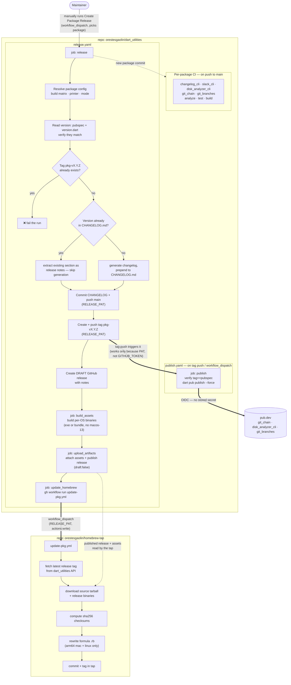

# Deploying a new release

The chart below illustrates the release process for a new package version. The main entry point is the `release.yaml` workflow, which can be triggered manually from the Actions tab. It will guide you through selecting the package to release and then automate the rest of the process, including changelog generation, tagging, creating a GitHub release, building binaries, and updating the Homebrew tap.

