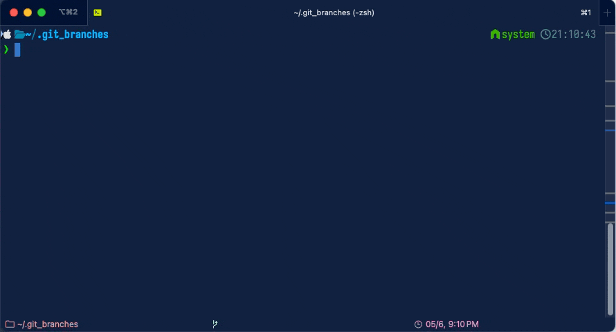

# git_branches

A terminal tool to find **merged and stale local git branches** and clean them
up - delete the dead ones, push the ones with unpushed work - without leaving
the keyboard.

| Main                                                                                                 | Delete screen                                                                                          |
| ---------------------------------------------------------------------------------------------------- | ------------------------------------------------------------------------------------------------------ |
|  |  |

It shows every local branch ordered by last activity, flags which are merged
into the default branch, stale, or have a gone/ahead upstream, and lets you act
on them either one key at a time or as a marked batch.

It detects **squash- and rebase-merged** branches too — the ones
`git branch --merged` can't see because their commits were collapsed into a
single new commit on the default branch. These show a `squashed` badge: their
work is already upstream, so they're safe cleanup candidates (deletion still
needs `-D`, which the tool handles).

Built with [`nocterm`](https://pub.dev/packages/nocterm), a sibling of
[`git_chain`](../git_chain).

## Install

```bash
dart pub global activate --source path .
# or, once published:
# dart pub global activate git_branches
```

Requires `git` on `PATH`.

## Usage

Run inside any git repository:

```bash
git_branches          # interactive UI (default)
git_branches list             # plain-text list, stalest first
git_branches list --merged    # only branches merged into the default branch
git_branches list --stale     # only unmerged branches idle for 60+ days
git_branches demo             # build a local demo repo to try it (no network)
```

## The UI

Each row shows: the selection mark, branch name (colored by state), last
activity, and status badges (`merged`, `stale`, `current`, `default`, `gone`,
`no-upstream`, `↑ahead`, `↓behind`). The current and default branches are pinned
to the top and protected from deletion.



### Marking & acting

Two ways to act, and they compose:

- **Batch** — press **Space** to cycle a branch's mark through
  `none → ✗ delete → ↑ push → none`. Mark as many as you like, then press
  **Enter** to apply them all at once after a confirmation summary.
- **Quick** — when nothing is marked, press **d** to delete or **p** to push
  the highlighted branch immediately.

| Key     | Action                                              |
| ------- | --------------------------------------------------- |
| `↑` `↓` | Move selection                                      |
| `Space` | Cycle mark: none → delete → push                    |
| `Enter` | Apply all marks (delete + push) with confirmation   |
| `Esc`   | Clear all marks                                     |
| `d`     | Delete highlighted branch now (when nothing marked) |
| `p`     | Push highlighted branch now (when nothing marked)   |
| `o`     | Cycle sort: stalest first / recent first / name     |
| `f`     | Cycle filter: all / merged / unmerged               |
| `r`     | Reload                                              |
| `?`     | Help                                                |
| `q`     | Quit                                                |

### What delete and push do

- **Delete** is **local only**: `git branch -d` for reachability-merged
  branches, and `git branch -D` (force) otherwise. Squash-merged branches use
  `-D` but are flagged as safe (work is upstream); genuinely unmerged branches
  get an explicit force-delete confirmation. Remote branches are never touched.
- **Push** runs `git push`, adding `-u origin <branch>` when the branch has no
  upstream yet.

## Trying it out

```bash
git_branches demo                      # ~/.git_branches/demo-repo (+ local remote)
cd ~/.git_branches/demo-repo && git_branches
# clean up:
rm -rf ~/.git_branches
```

The demo creates a repo (with a local bare remote, so pushes really work)
containing merged branches, stale unmerged branches with old dates, a branch
with unpushed commits, and one whose remote was deleted — so every badge and
action is exercised.

## Architecture

```
lib/src/
  git/git_repo.dart       — git CLI wrapper: branch listing, merge detection, delete, push
  models.dart             — BranchInfo, MarkState, SortOrder, BranchFilter
  display/branches_app.dart — nocterm TUI
  commands/               — tui / list / demo
```
