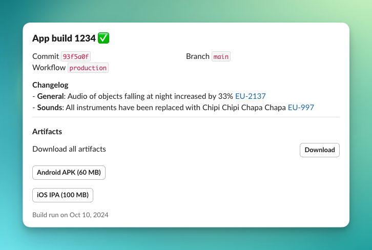

## slack_cli

Simple CLI to call Slack API and send messages.

```sh
slack_cli post -t xoxb-xxx \
  -c channel-name \
  -m "Hello world"
```

Supported commands:

- `post` - sends a message to Slack channel
- `update` - updates the CLI

## Getting Started 🚀

Activate globally from pub.dev via:

```sh
dart pub global activate slack_cli
```

Or locally via:

```sh
dart pub global activate --source=path <path to this package>
```

## Posting messages

The `post` command allows to send messages to desired Slack channel. Before you use this CLI, you need to create Slack app and get bot token. See [this official manual](https://api.slack.com/quickstart) for more details. Once you have the token (it starts with `xoxb-`), you can use it to send messages to Slack channels.

```sh
slack_cli post --token <token> --channel <channel> --message <message> --blocks <blocks>
```

### Examples

```sh
slack_cli post -t xoxb-xxx \
-c builds \
-m "Build 1234 finished" \
-b "[header=App build 1234 :white_check_mark:][fields=Commit \`93f5a0f\`=Branch \`main\`=Workflow \`production\`][text=*Changelog*\n - *General*: Audio of objects falling at night increased by 33% <https://pub.dev|EU-2137>\n - *Sounds*: All instruments have been replaced with Chipi Chipi Chapa Chapa <https://pub.dev|EU-997>][divider][text=*Artifacts*][button_section=Download all artifacts url=http://pub.dev title=Download][button=Android APK (60 MB) url=http://pub.dev][button=iOS IPA (100 MB) url=http://pub.dev][context=Build run on Oct 10, 2024]"
```



### Supported blocks

Blocks to send to the channel, each block has its own type and formatting.

Special characters used as delimiters: `[ ] =`

```
[text=This is simple text with *markdown* support and <http://google.com|links>]
[header=This is the header]
[divider]
[img=https://assets3.thrillist.com/v1/image/1682388/size/tl-horizontal_main.jpg title=required title]
[fields=Text fields _use_ *markdown*=and are separated with=equal sign]
[button=Button label url=http://pub.dev]
[button_section=Text on the left side url=http://pub.dev title=Button title] - all properties required
[context=This is _tiny_ message shown below]',
```

## Special thanks

This project uses block classes from [slack_notifier](https://pub.dev/packages/slack_notifier).
